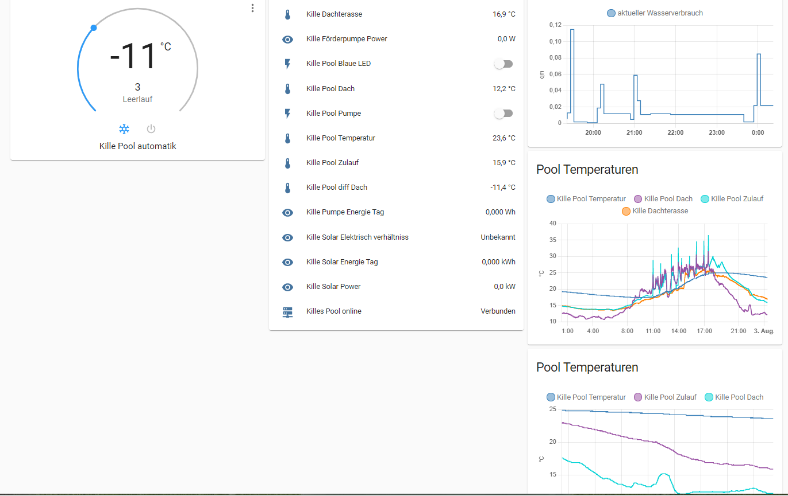

# solar_pool_heater

It was working grat during the summer! Maximum 38°C in the pool at the evening :sunglasses:.

I’ve used a sonoff TH16 with a 3 temp sensors:

at the roof
in the pool
in the intake pipe
I calculate also the energy of the pump and the energy that the solar heater produce.****
